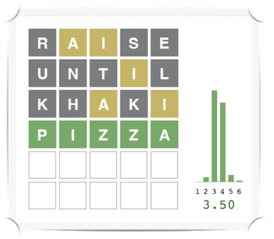

## Wordle

The assignment description can be found [here](https://docs.google.com/document/d/1NW6Ejy7aX54DOy4fWVTY255MPwNhjIcNXtChd08KFKI/edit?usp=sharing).

This repository contains a starter file for the code you need to write:
- `agent.py`: Put code in this file.

It also contains code that you don't need to look at (though you're welcome to) and should 
not change:
- `game.py`: Implementation of the Wordle game.
- `graphics.py`: Graphics support for the game.
- `util.py`: Miscellaneous classes and functions.

Ignore (but do not delete!!!) the other files in this repository.