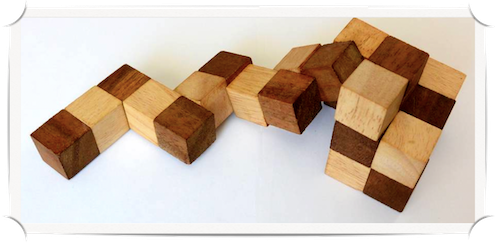

## Blocks

The assignment description can be found [here](https://docs.google.com/document/d/18jKkf3J997xi5g5y6n-roLmsQN3-VfgkKkprK6RC5do/edit?usp=sharing).

This repository contains a starter file for the code you need to write:
- `puzzle.py`: Put code in this file.

It also contains code that you can use but should not change:
- `search.py`: Implementation of search algorithms from class.
- `ladder.py`: Search-based problem solving for the word ladder problem.

Ignore (but do not delete!!!) the other files in this repository.