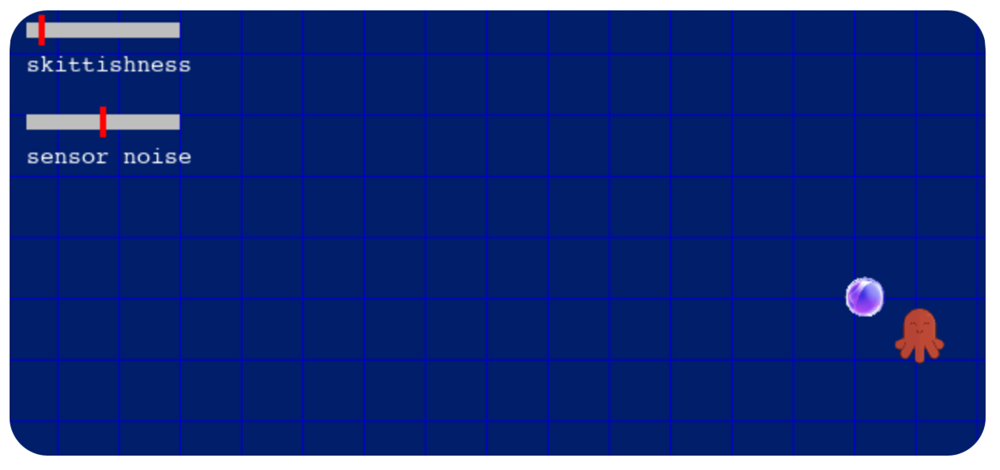

## The Squid and the Whale

The assignment description can be found [here](https://docs.google.com/document/d/1ErQazap0BSL9eY_ri5akP0-VzZc5rSAMwmCsT_0H4vE/edit?usp=sharing).

This repository contains starter code:
- `tracker.py`: Code for questions one to four goes in this file

It also contains visualizers that you will use but should not change:
- `descent.py`: The whale visualizer.
- `sonar.py`: The squid visualizer.

Ignore (but do not delete!!!) the other files in this repository.