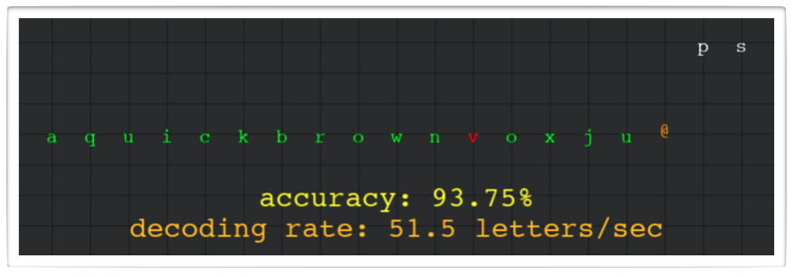

## Turbo Coding

The assignment description can be found [here](https://docs.google.com/document/d/174HeucnFw13xokakRB2K1oUWcwJRQP11kD9Y6CvP7Nw/edit?usp=sharing).

This repository contains a starter file for the code you need to write:
- `coder.py`: Put code in this file.

It also contains code that you don't need to look at (though you're welcome to) and should 
not change:
- `turbo.py`: Evaluates the accuracy and decoding rate of the coders.
- `plane.py`: Graphics support for the visualizer.
- `util.py`: Utility functions for bit transmission and coder evaluation.

Ignore (but do not delete!!!) the other files in this repository.